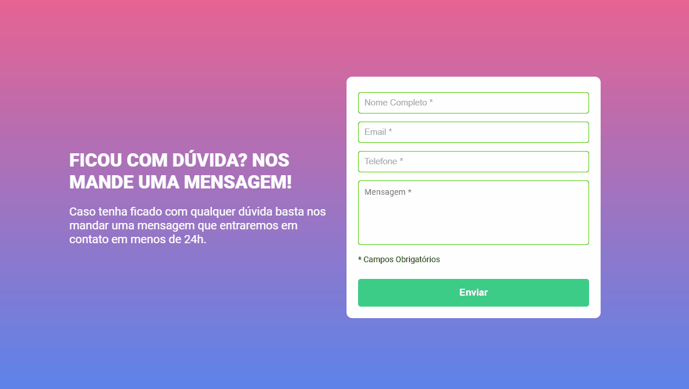

# Formulário - React + Vite

- [Visão Geral](#visao-geral)
  - [O Projeto](#o-projeto)
  - [Screenshot](#screenshot)
  - [Links](#links)
- [Meu Processo](#meu-processo)
  - [Construído com](#construido-com)
  - [O Que Eu Aprendi](#o-que-eu-aprendi)
  - [Recursos Úteis](#Recursos-uteis)
- [Autor](#autor)

## Visão Geral

### O projeto

O projeto consiste em uma atualizão do validacao-de-formulario. Nesse projeto foi adicionado o React, mudanças no HTML e CSS e melhorias no JavaScript.

### Screenshot

### Links
- Live Site URL: [Formulário - React + Vite](https://formulario-com-react-alpha.vercel.app/)

## Meu processo

### Construido com

- HTML
- CSS
- JavaScript
- React
- [Google Fonts](https://fonts.google.com/) - Para fonte

### O que eu aprendi

Nesse projeto eu pude trabalhar com o React na prática, aperfeiçoando meu conhecimento com a biblioteca e pude fazer upload no Vercel pela primeira vez, aumentando o meu conhecimento.

### Recursos Úteis

- [React hook form](https://www.react-hook-form.com/) - Site da documentação do React hook form.

## Autor

- LinkedIn - [Lucas Laino](https://www.linkedin.com/in/lucaslaino/)
- Frontend Mentor - [@LucasLaino](https://www.frontendmentor.io/profile/LucasLaino)